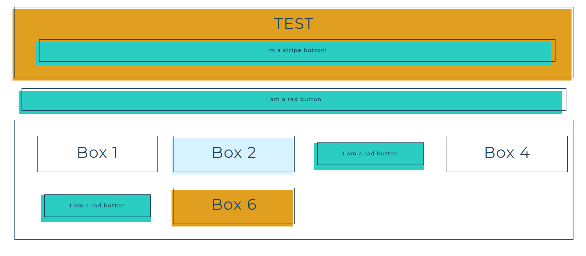

# gatsby-theme-west-egg-style

A Gatsby theme that provides a set of styled components.

Add to your Gatsby sites gatsby-config.js just like you would with a plugin.

```
module.exports = {

    __experimentalThemes: ['gatsby-theme-west-egg-style']
}
```

Example usage:

```
import React from 'react';
import {Box, Title, Button, Grid} from 'gatsby-theme-west-egg-style';
import colors from 'gatsby-theme-west-egg-style/src/utils/colors';
import { StripeCheckout } from 'gatsby-theme-west-egg-stripe-cart';

const elements = [
    <Box noBackground>
        <Title fontWeight="400">Box 1</Title>
    </Box>,
     <Box color={colors.light}>
        <Title fontWeight="400">Box 2</Title>
    </Box>,
    <Button text="I am a rad button"/>,
    <Box noBackground>
        <Title fontWeight="400">Box 4</Title>
    </Box>,
    <Button text="I am a rad button"/>,
     <Box color={colors.accent}>
        <Title fontWeight="400">Box 6</Title>
    </Box>,
]


export default () => (
    <div style={{margin: '5rem'}}>
        <Box color={colors.accent}>
            <Title fontWeight="400">TEST</Title>
            <StripeCheckout 
                button={<Button type="submit" text="Im a stripe button!"/>}
                sku='sku_F2wt2pvjhQrs0w'
                quantity={1}
            />   
        </Box>
        <div style={{marginTop: '2rem'}}>
            <Button text="I am a rad button"/>
        </div>
        <Box noBackground>
            <Grid elements={elements}/>
        </Box>
    </div>
)
```

Produces: 




Current status: WIP

## Built With

- [Gatbsy](https://www.gatsbyjs.org/)
- [Emotion](https://emotion.sh/docs/introduction)
- [TypeScript](https://www.typescriptlang.org/)

## Authors

- **Rich Haines** - _Hungry Bear Studio_

## License

This project is licensed under the MIT License
